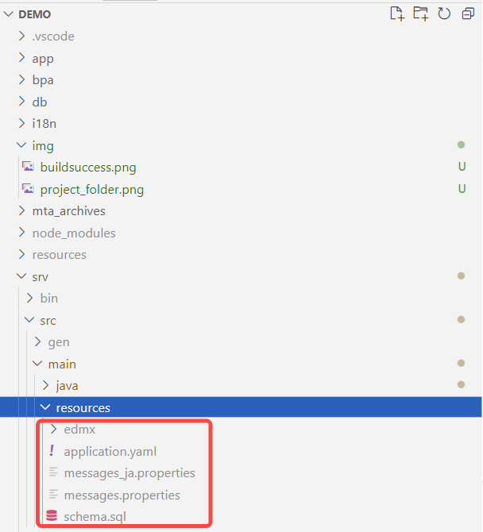
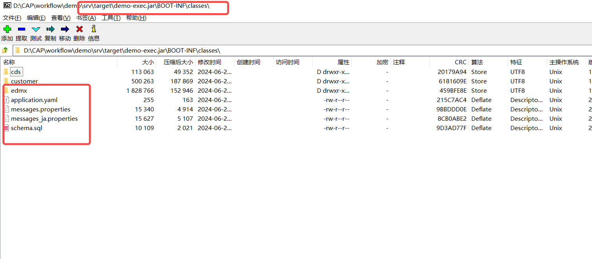
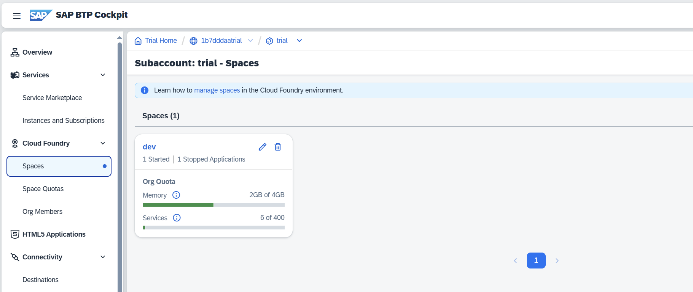
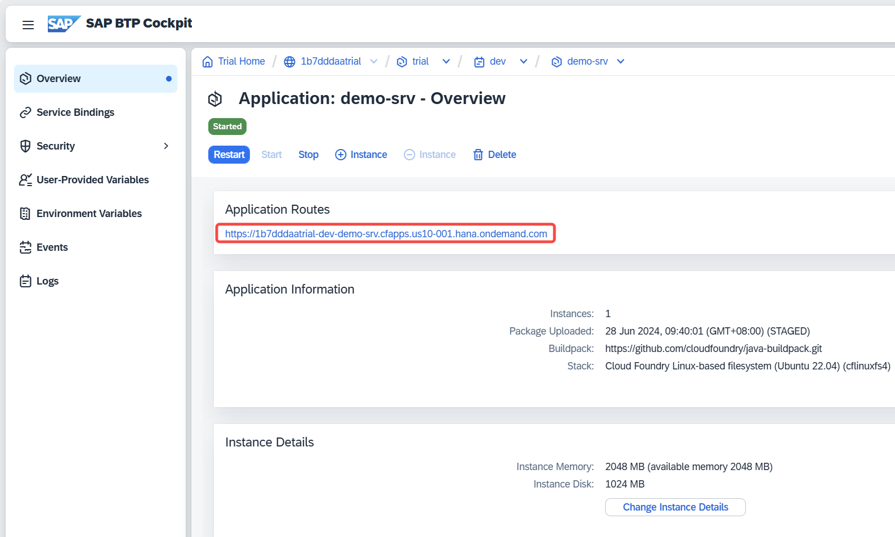
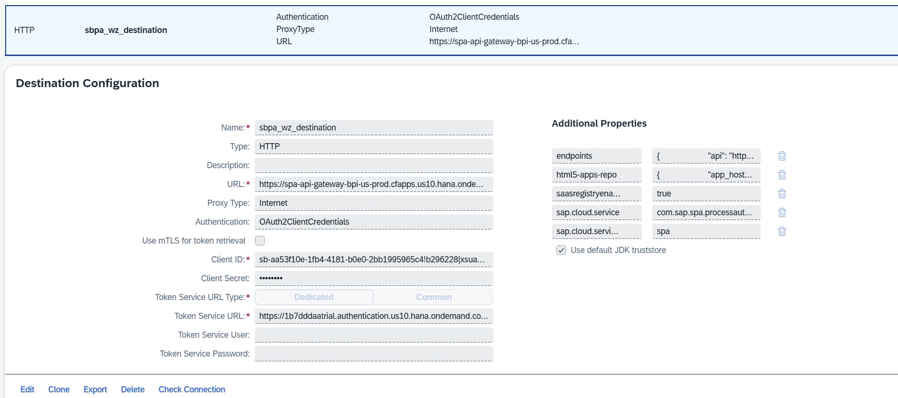
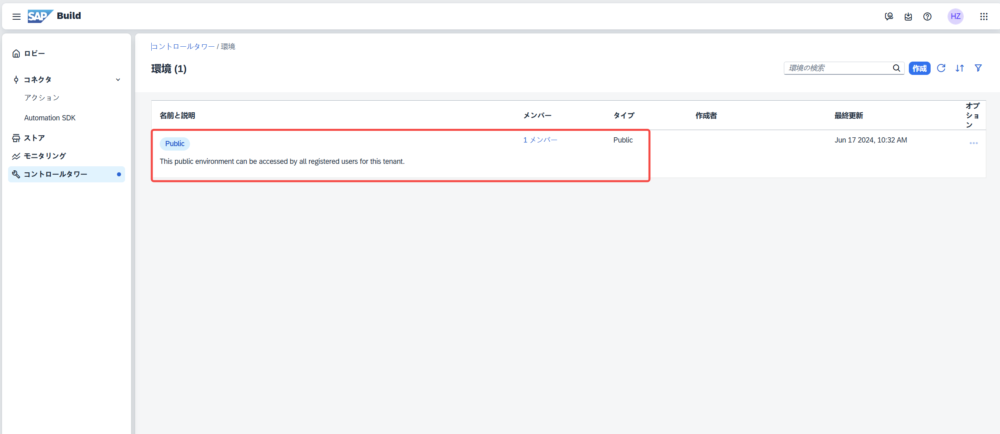

# SAP CAP & Build Process Automation Demo 项目

SAP CAP & Build Process Automation Demo 项目。包含以下功能:

1. 发票单据新规登录&承认依赖
2. 发票承认

## 项目目录

- [app] UI 存放目录
  - [appconfig](#app-config) 本地 sandbox Launchpad 的配置目录(不会部署到 SAP BTP Trial)
  - [cprepaymentpendinginvs](#cprepaymentpendinginvs) 新规登录 Fiori App(SAP Custom App with Building Block)
  - [prepaymentpendinginvsapproval](#prepaymentpendinginvsapproval) 发票审批 UI(SAP Build Process Automation 审批 UI)
  - fiori.html 本地 sandbox launchpad html 文件

### app config

如需配置请参考：
<https://help.sap.com/doc/saphelp_nw75/7.5.5/en-US/59/ea851d55e04c69a5ae07b15a3eda1b/content.htm?no_cache=true>

### cprepaymentpendinginvs

使用 SAP Custom Page application + SAP Build Block 技术开发的 SAP Fiori 应用。适用于 SAP OData V4 接口。

### prepaymentpendinginvsapproval

使用 SAP Build Process Process Approval UI 技术开发的 SAP Fiori 应用。适用于嵌入标准 App My Inbox。

## 部署步骤

将 SAP CAP 程序/SAP Fiori 应用/SAP Build Process Automation 项目部署至 SAP BTP 环境中。

### 大纲

- [先决条件](#先决条件)
  - [Cloud 环境配置](#cloud-环境配置)
  - [本地环境配置](#本地环境配置)
- [部署SAP CAP项目](#部署sap-cap-项目)
  - [编译](#编译)
  - [登录Cloud Foundry环境](#登录-cloud-foundry-环境)
  - [部署mtar文件](#部署-mtar-文件)
- [SAP BTP Trial环境配置](#sap-btp-trial-环境配置)
  -[手动配置Destination](#手动配置-destination)
- [SAP Build Process Automation 配置](#sap-build-process-automation-配置)
  - [配置 Destination](#配置-destination)
  - [导入 Action Project](#导入-action-project)
  - [导入 SAP BPA Project](#导入-sap-bpa-project)
  - [查看部署的Workflow Definition](#查看部署的workflow-definition)
- [修改SAP CAP Java中触发工作流的代码](#修改sap-cap-java中触发工作流的代码替换workflow-definition-id)
- [SAP Build WorkZone 配置](#sap-build-workzone-配置)
- [使用](#使用)

### 先决条件

1. Cloud 环境配置：部署上述应用至 SAP BTP 环境需要启用一些 SAP BTP Subscription 和 Service。
2. 本地环境配置：将 SAP CAP/Fiori 应用编辑和部署需要用到的工具

#### Cloud 环境配置

1. 启用 SAP BTP Trial
   - <https://developers.sap.com/tutorials/hcp-create-trial-account.html>
2. 启用 SAP HANA Cloud
   - <https://developers.sap.com/tutorials/hana-cloud-deploying.html>
3. 启用 SAP Build Process Automation
   - <https://developers.sap.com/tutorials/spa-subscribe-booster.html>
4. 启用 SAP Build WorkZone
   - <https://developers.sap.com/tutorials/cp-portal-cloud-foundry-getting-started.html>

5. 分配 SAP BTP 权限

   |Subscription|权限集合|描述|
   | --- | --- | --- |
   |SAP HANA Cloud|SAP HANA Cloud Administrator|HANA Cloud Administrator|
   |SAP HANA Cloud|SAP HANA Cloud Security Administrator|Security Admin|
   |SAP HANA Cloud|SAP HANA Cloud Viewer|Reader|
   |SAP Build Process Automation|ProcessAutomationAdmin|BPA Admin|
   |SAP Build Process Automation|ProcessAutomationDeveloper|BPA Developer|
   |SAP Build Process Automation|ProcessAutomationParticipant|Workflow Participant|
   |SAP Build WorkZone|Launchpad_Admin|Launchpad Admin|
   |SAP Build WorkZone|Launchpad_Advanced_Theming|Launchpad Theme|
   <!-- |SAP Build WorkZone|Launchpad_Admin|Launchpad_Admin -->

#### 本地环境配置

1. Open JDK 21 +
    - <https://github.com/adoptium/temurin21-binaries/releases/download/jdk-21.0.3+9/OpenJDK21U-jdk_x64_windows_hotspot_21.0.3_9.msi> (Windows)
2. Maven 3.9.+
    - <https://maven.apache.org/download.cgi>
3. Node.js 21
    - <https://nodejs.org/en>
4. Npm(Bundle as Node.js)
5. @sap/cds-dk 7.9.+
    - <https://cap.cloud.sap/docs/> SAP CAP Documentation
    - <https://cap.cloud.sap/docs/tools/cds-cli> SAP CAP CDS Command Line Interface
6. cloud foundry cli v7/v8
    - <https://github.com/cloudfoundry/cli/wiki/V8-CLI-Installation-Guide>
7. mbt
    - <https://www.npmjs.com/package/mbt>

    ```bash
    npm install mbt
    ```

8. cloud foundry cli plugins / multiapps 3.2.+
    - <https://github.com/cloudfoundry-incubator/multiapps-cli-plugin>

    ```bash
    cf install-plugin multiapps
    ```

9. any other tools if you want to install please refer:
   - <https://tools.hana.ondemand.com/#cloud>

### 部署SAP CAP 项目

请事先准备好项目源代码，并确保文件已经解压。


#### 编译

1. 打开终端(Windows Terminal / Powershell / Git Bash)
2. 导航至项目根目录(mta.yaml同级目录)
    - 确保已经导航至正确的位置
3. 运行命令mbt build

    ```bash
    mbt build
    ```

4. 运行完成后，检查终端是否是编译成功的状态
    - 

5. 检查Jar包编辑过程中是否将src/main/resources下的文件全部拷贝至 src/target/*-exec.jar/BOOT-INF/classes下。
    - 如果src/target/*-exec.jar/BOOT-INF/classes没有resources目录下的文件，则即使第4步成功，也是编译失败的，因为后续部署SAP CAP Java应用程序会报错。`需要重新运行mbt build命令，直至成功为止。`
    - 
    - 
6. 运行成功后，检查mta_archives中是否存在*.mtar文件
    - 

#### 登录 cloud foundry 环境

1. 运行cloud foundry cli命令

    ```bash
    cf login
    ```

2. 输入SAP S User对应的E-mail和账户密码。
    - 

#### 部署 mtar 文件

1. 运行命令cf deploy
    - 注意选择mta_archieves下的`*.mtar`文件

    ```bash
    cf deploy mta_archives/demo_1.0.0-SNAPSHOT.mtar
    ```

2. 终端窗口查看部署结果
    - 成功  
    

3. 登录至SAP BTP环境检查部署结果
    - SAP HANA Cloud中数据库表的部署结果
        - 使用SAP HANA Cloud Central -> SAP
        - 
        - 请参考<https://help.sap.com/docs/hana-cloud/sap-hana-database-explorer/getting-started-with-sap-hana-database-explorer?locale=en-US>
    - SAP CAP Java
        - 导航至SAP BTP Subaccount -> Org -> Space
        
        - 查看Application页签下应用的部署状态，查看`*srv`程序
        
    - SAP Fiori应用(必须先启用了SAP Build WorkZone)
        - 导航至SAP BTP Subaccount -> HTML5 Applications
        - 查看List
        

### SAP BTP Trial 环境配置

#### 手动配置 Destination

1. 添加供SAP BPA使用的 SAP CAP Java OData 服务对应的Destination
    - <https://help.sap.com/docs/build-process-automation/sap-build-process-automation/using-sap-cloud-application-programming-model?locale=en-US>
    - `Name`: XXX
    - `Type`: HTTP
    - `Url`: 使用上述部署好的SAP CAP Java 应用`*srv`中的url地址
        - application route属性 + 固定Uri后缀`/odata/v4/PrePayment`
        - 
    - `Proxy Type`: Internet
    - `Authentication`: OAuth2ClientCredentials
    - `Client ID`: UAA Service Instance -> Service Key -> 中的clientid
    - `Client Secret`: UAA Service Instance中clientsecret
    - `Token Service URL`: UAA Service Instance中 url + 固定Uri后缀`/oauth/token`
    - 
    - Property `sap.applicationdevelopment.actions.enabled`: true
    - Property `sap.build.usage`: odata_gen
    - Property `sap.processautomation.enabled`: true
2. 添加供SAP Build WorkZone使用的SAP BPA服务对应的Destination(将My Inbox暴露给SAP Build WorkZone)
    - 

3. 添加供审批UI App prepaymentpendinginvsapproval使用的destination
    - 

### SAP Build Process Automation 配置

登录至SAP Build Process Automation Lobby站点。


#### 配置 Destination

请参考：
<https://help.sap.com/docs/build-process-automation/sap-build-process-automation/manage-destinations?q=destination>


#### 导入 Action Project

1. 导入Action Project
    - 导航至action。点击右侧导入按钮，选择`bpa/action_project/invoice_1.0.0.mtar`文件
    - 

2. Release Action Project
    - 请参考<https://help.sap.com/docs/build-process-automation/sap-build-process-automation/managing-action-project>

#### 导入 SAP BPA Project

1. 导入 SAP BPA Project
    - 导航至Lobby。点击右侧导入按钮，选择'bpa/project/prepaymentpendinginvoicewf2_1.0.4.mtar'文件
    - 
2. Release Project
    - 请参考<https://help.sap.com/docs/build-process-automation/sap-build-process-automation/releasing-project>
    - Release的时候可能需要选择Destination参数，请选择上述步骤SAP BPA中的Destination
3. Deploy Project
    - 请参考<https://help.sap.com/docs/build-process-automation/sap-build-process-automation/deploy-project>
    - Deploy的时候可能需要选择Destination参数，请选择上述步骤SAP BPA中的Destination

#### 查看部署的Workflow Definition

1. 导航至Control Tower页签 -> Environment -> API页签
    - 
    - 
    - 
    - 查看API Trigger的参数
    - 
    - 获取SAP BPA Workflow Definition ID
    - 

### 修改SAP CAP Java中触发工作流的代码(替换Workflow definition ID)

由于部署到不同的环境，Workflow definition ID会发生变化。`<region>.<subaccount>.<projectID>.<processID>`

1. 找到`srv/src/main/java/customer/demo/PrePaymentServiceHandler.java文件`，导航至`sendToApprove`方法，将代码`payload.definitionId(XXX)`中的参数替换掉。

    ```bash
    payload.definitionId("us10.1b7dddaatrial.prepaymentpendinginvoicewf2.prepaymentpendinginvoicewf");
    ```

2. 替换成上述步骤中获取到的[SAP BPA Workflow Definition ID](#查看部署的workflow-definition)
3. 重新编译+部署，可以参照[前面配置](#部署sap-cap-项目)

### SAP Build WorkZone 配置

请参考：
    -<https://help.sap.com/docs/build-process-automation/sap-build-process-automation/configure-sap-build-work-zone-for-sap-build-process-automation>

### 使用

通过SAP Build WorkZone中创建的站点进入使用App。
    - 
