# SAP CAP & Build Process Automation Demo プロジェクト

SAP CAP & Build Process Automation Demo プロジェクト。以下の機能を含む:

1. 伝票の新規登録＆承認依頼
2. 伝票の承認

## プロジェクトディレクトリ

- `app` UI 格納ディレクトリ
  - [appconfig](#app-config) ローカル sandbox Launchpad の設定ディレクトリ( SAP BTP Trialにはデプロイしない)
  - [cprepaymentpendinginvs](#cprepaymentpendinginvs) 新规登录 Fiori App(SAP Custom App with Building Block)
  - [prepaymentpendinginvsapproval](#prepaymentpendinginvsapproval) 伝票承認 UI(SAP Build Process Automation 承認 UI)
  - fiori.html ローカル sandbox launchpad html ファイル
- `srv` SAP CAP Javaプログラム
- `db` SAP HANA Cloud Artifacte
- `i18n` 翻訳
- `bpa` SAP Build Process Automationプロジェクト
  - `action_project` action project格納ディレクトリ
  - `project` workflow project格納ディレクトリ

### app config

設定したい場合、以下のリンクをご参照ください：
<https://help.sap.com/doc/saphelp_nw75/7.5.5/en-US/59/ea851d55e04c69a5ae07b15a3eda1b/content.htm?no_cache=true>

### cprepaymentpendinginvs

 SAP Custom Page application + SAP Build Block 技術が開発した SAP Fiori アプリを使用する。 SAP OData V4 インターフェースに適用される。

### prepaymentpendinginvsapproval

 SAP Build Process Process Approval UI 技術が開発した SAP Fiori アプリを使用する。嵌入標準 App My Inboxに適用される。

## デプロイステップ

 SAP CAP プログラム/SAP Fiori アプリ/SAP Build Process Automation プロジェクトを SAP BTP 環境にデプロイする。

### 大綱

- [前提条件](#前提条件)
  - [Cloud 環境設定](#cloud-環境設定)
  - [ローカル環境設定](#ローカル環境設定)
- [デプロイSAP CAPプロジェクト](#sap-cap-プロジェクトデプロイ)
  - [コンパイル](#コンパイル)
  - [登録Cloud Foundry環境登録](#cloud-foundry-環境登録)
  - [デプロイmtarファイル](#mtar-ファイルデプロイ)
- [SAP BTP Trial環境設定](#sap-btp-trial-環境設定)
  - [手動設定Destination](#destination手動設定)
- [SAP Build Process Automation 設定](#sap-build-process-automation-設定)
  - [設定 Destination](#destination設定)
  - [導入 Action Project](#action-project導入)
  - [導入 SAP BPA Project](#sap-bpa-project導入)
  - [デプロイしたWorkflow Definitionを検査する](#デプロイしたworkflow-definitionを検査)
- [SAP CAP Javaでトリガーしたワークフローのコードを修正する](#sap-cap-javaでトリガーしたワークフローのコードを修正するworkflow-definition-idを入れ替わる)
- [SAP Build WorkZone 設定](#sap-build-workzone-設定)
- [使用](#使用)

### 前提条件

1. Cloud 環境設定：上述のアプリを SAP BTP 環境に配置したい場合、 SAP BTP Subscription と Serviceを起動する必要がある。
2. ローカル環境設定： SAP CAP/Fiori アプリを編集とデプロイする際に必要なツール

#### Cloud 環境設定

1. SAP BTP Trial起動
   - <https://developers.sap.com/tutorials/hcp-create-trial-account.html>
2. SAP HANA Cloud起動
   - <https://developers.sap.com/tutorials/hana-cloud-deploying.html>
3. SAP Build Process Automation起動
   - <https://developers.sap.com/tutorials/spa-subscribe-booster.html>
4. SAP Build WorkZone起動
   - <https://developers.sap.com/tutorials/cp-portal-cloud-foundry-getting-started.html>

5. SAP BTP 権限を割り当て

   |Subscription|権限集合|説明|
   | --- | --- | --- |
   |SAP HANA Cloud|SAP HANA Cloud Administrator|HANA Cloud Administrator|
   |SAP HANA Cloud|SAP HANA Cloud Security Administrator|Security Admin|
   |SAP HANA Cloud|SAP HANA Cloud Viewer|Reader|
   |SAP Build Process Automation|ProcessAutomationAdmin|BPA Admin|
   |SAP Build Process Automation|ProcessAutomationDeveloper|BPA Developer|
   |SAP Build Process Automation|ProcessAutomationParticipant|Workflow Participant|
   |SAP Build WorkZone|Launchpad_Admin|Launchpad Admin|
   |SAP Build WorkZone|Launchpad_Advanced_Theming|Launchpad Theme|
   <!-- |SAP Build WorkZone|Launchpad_Admin|Launchpad_Admin -->

#### ローカル環境設定

1. Open JDK 21 +
    - <https://github.com/adoptium/temurin21-binaries/releases/download/jdk-21.0.3+9/OpenJDK21U-jdk_x64_windows_hotspot_21.0.3_9.msi> (Windows)
2. Maven 3.9.+
    - <https://maven.apache.org/download.cgi>
3. Node.js 21
    - <https://nodejs.org/en>
4. Npm(Bundle as Node.js)
5. @sap/cds-dk 7.9.+
    - <https://cap.cloud.sap/docs/> SAP CAP Documentation
    - <https://cap.cloud.sap/docs/tools/cds-cli> SAP CAP CDS Command Line Interface
6. cloud foundry cli v7/v8
    - <https://github.com/cloudfoundry/cli/wiki/V8-CLI-Installation-Guide>
7. mbt
    - <https://www.npmjs.com/package/mbt>

    ```bash
    npm install mbt
    ```

8. cloud foundry cli plugins / multiapps 3.2.+
    - <https://github.com/cloudfoundry-incubator/multiapps-cli-plugin>

    ```bash
    cf install-plugin multiapps
    ```

9. any other tools if you want to install please refer:
   - <https://tools.hana.ondemand.com/#cloud>

### SAP CAP プロジェクトデプロイ

事前にプロジェクトのソースコードを用意し、ファイルが解凍されたことを確保する。

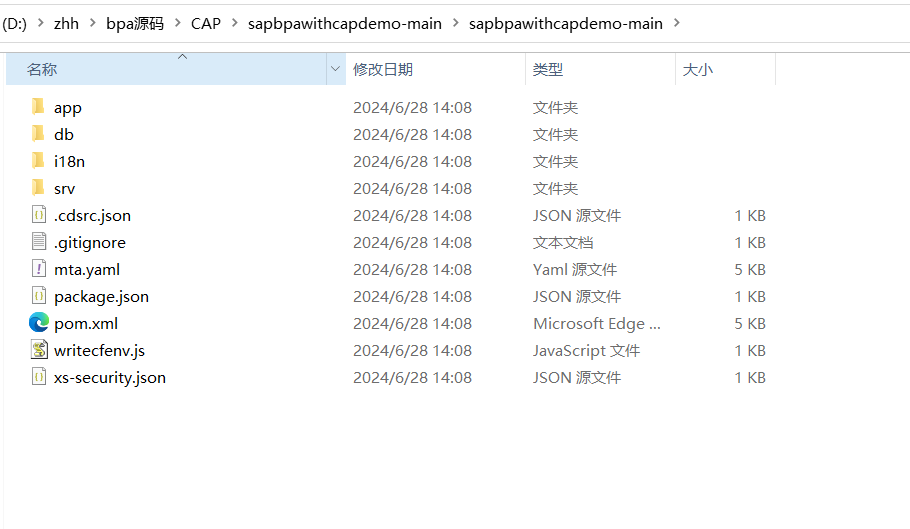

#### コンパイル

1. 端末を開く(Windows Terminal / Powershell / Git Bash)
2. プロジェクトのルートディレクトリにナビゲートする(mta.yaml同級ディレクトリ)
    - 正確な位置にナビゲートしたことを確保する
3. mbt buildコマンドを実行する

    ```bash
    mbt build
    ```

4. 実行完了後、端末がコンパイル成功の状態になっているかを確認するｓ
    - 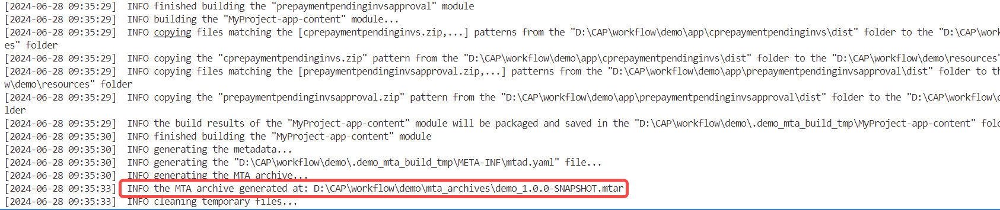

5. Jarパッケージの編集過程でsrc/main/resourcesの下にあるすべてのファイルが src/target/*-exec.jar/BOOT-INF/classesの下にコピーされているかどうかを確認する。
    - もしsrc/target/*-exec.jar/BOOT-INF/classesにresourcesディレクトリの下にあるファイルがない場合、後続のSAP CAP Javaアプリケーションをデプロイする際エラーが発生するため、4が成功しても、コンパイルが失敗している。`成功するまで、mbt buildコマンドを再実行する必要がある。`
    - 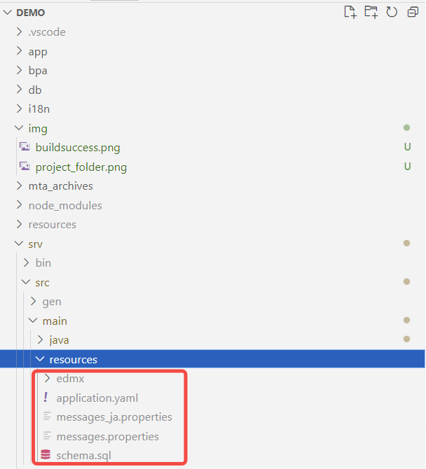
    - 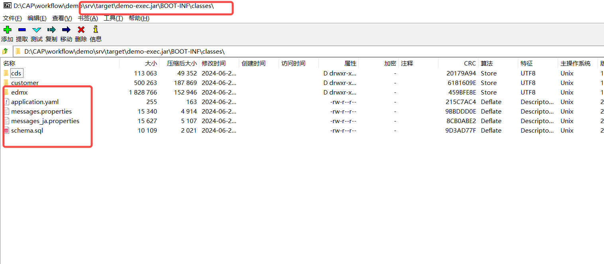
6. 実行完了後、mta_archivesに*.mtarファイルが存在するかどうかを確認する
    - 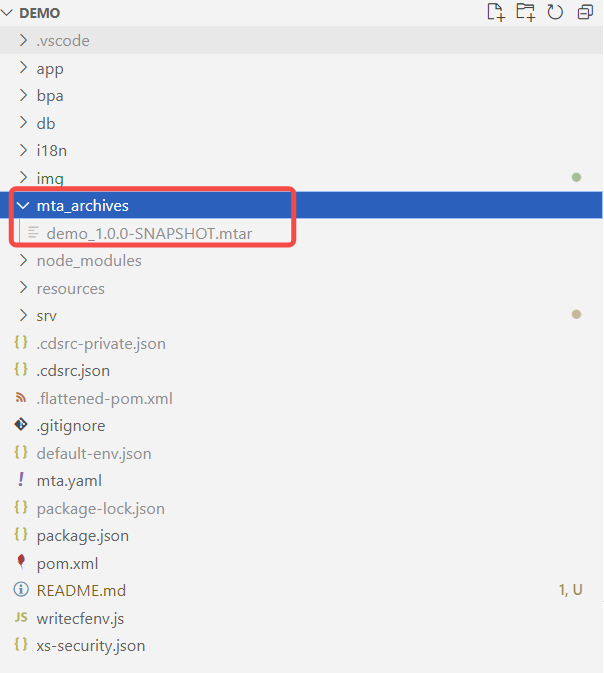

#### cloud foundry 環境登録

1. cloud foundry cliコマンドを実行する

    ```bash
    cf login
    ```

2. SAP S Userに適応するE-mailとアカウントのパスワードを入力する。
    - 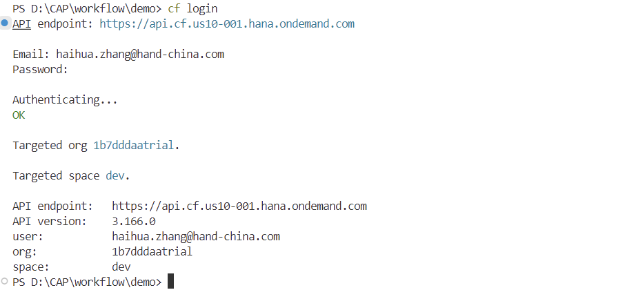

#### mtar ファイルデプロイ

1. cf deployコマンドを実行する
    - mta_archievesの下にある`*.mtar`ファイルを選択する。

    ```bash
    cf deploy mta_archives/demo_1.0.0-SNAPSHOT.mtar
    ```

2. ターミナル ウィンドウで、デプロイ結果を検査する
    - 成功  
    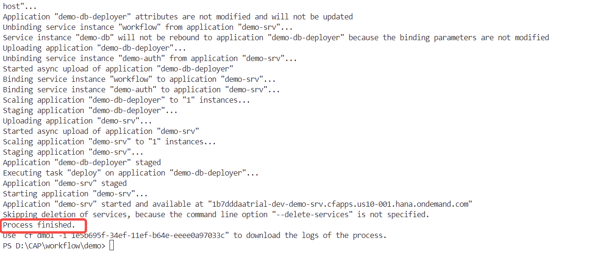

3. SAP BTP環境に登録し、デプロイ結果を確認する
    - SAP HANA Cloudのデータベーステーブルのデプロイ結果
        - SAP HANA Cloud Central -> SAPを使用
        - 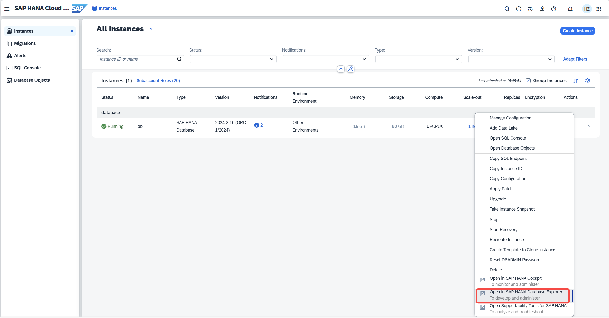
        - 参考<https://help.sap.com/docs/hana-cloud/sap-hana-database-explorer/getting-started-with-sap-hana-database-explorer?locale=en-US>
    - SAP CAP Java
        - SAP BTP Subaccount -> Org -> Spaceにナビゲート
        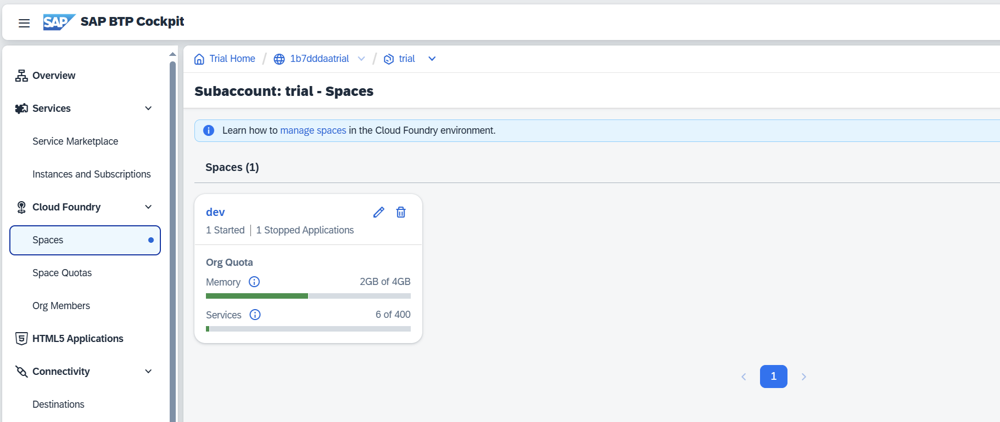
        - Applicationタブのアプリのデプロイ状態を検査し、`*srv`プログラムを検査する
        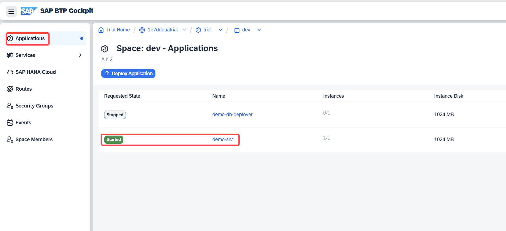
    - SAP Fiori应用(先にSAP Build WorkZoneを起動する)
        - SAP BTP Subaccount -> HTML5 Applicationsにナビゲート
        - Listを検査
        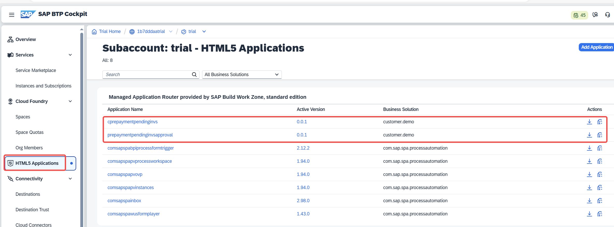

### SAP BTP Trial 環境設定

#### Destination手動設定

1. SAP BPA使用する SAP CAP Java OData サービスに適応するDestinationを追加する
    - <https://help.sap.com/docs/build-process-automation/sap-build-process-automation/using-sap-cloud-application-programming-model?locale=en-US>
    - `Name`: XXX
    - `Type`: HTTP
    - `Url`: 上述でデプロイしたSAP CAP Java アプリの`*srv`のurlアドレスを使用する
        - application route属性 + Uriサフィックスの`/odata/v4/PrePayment`を固定する
        - 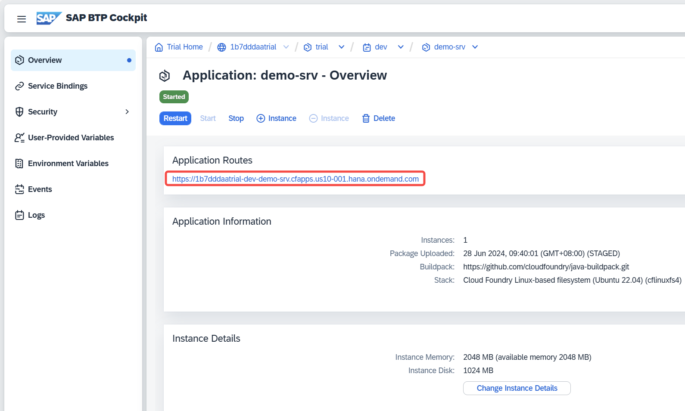
    - `Proxy Type`: Internet
    - `Authentication`: OAuth2ClientCredentials
    - `Client ID`: UAA Service Instance -> Service Key -> のclientid
    - `Client Secret`: UAA Service Instance中clientsecret
    - `Token Service URL`: UAA Service Instance中 url + Uriサフィックスの`/oauth/token`を固定する
    - 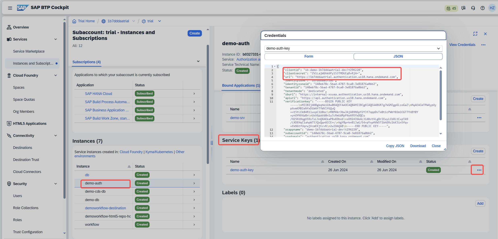
    - Property `sap.applicationdevelopment.actions.enabled`: true
    - Property `sap.build.usage`: odata_gen
    - Property `sap.processautomation.enabled`: true
2. SAP Build WorkZone使用するSAP BPAサービスに適応するDestinationを追加する(My InboxをSAP Build WorkZoneに暴露する)
    - 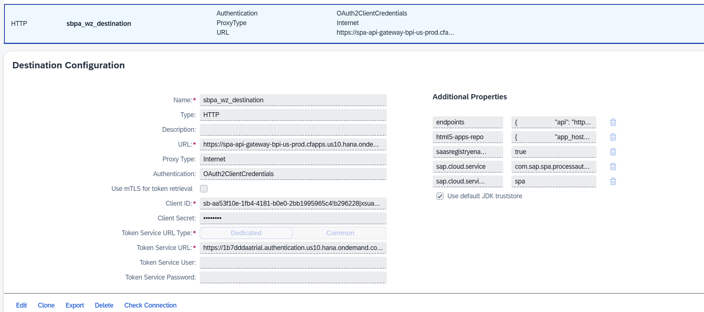

3. 承認UI App prepaymentpendinginvsapproval使用するdestinationを追加する
    - 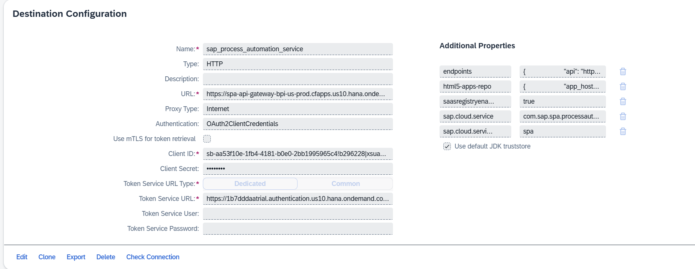

### SAP Build Process Automation 設定

SAP Build Process Automation Lobbyサイトに登録する。

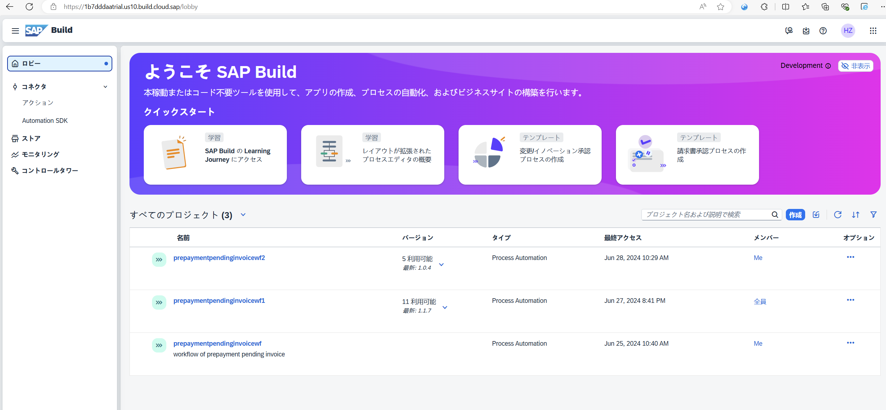

#### Destination設定

参考：
<https://help.sap.com/docs/build-process-automation/sap-build-process-automation/manage-destinations?q=destination>

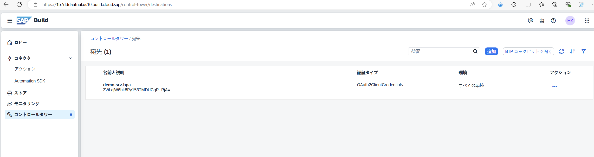

#### Action Project導入

1. Action Projectを導入する
    - actionにナビゲートする。右側の導入ボタンをクリックし、`bpa/action_project/invoice_1.0.0.mtar`ファイルを選択する
    - 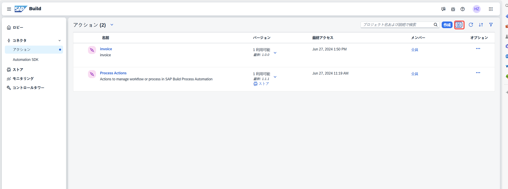

2. Release Action Project
    - 参考<https://help.sap.com/docs/build-process-automation/sap-build-process-automation/managing-action-project>

#### SAP BPA Project導入

1. SAP BPA Projectを導入する
    - Lobbyにナビゲートする。右側の導入ボタンをクリックし、'bpa/project/prepaymentpendinginvoicewf2_1.0.4.mtar'ファイルを選択する
    - 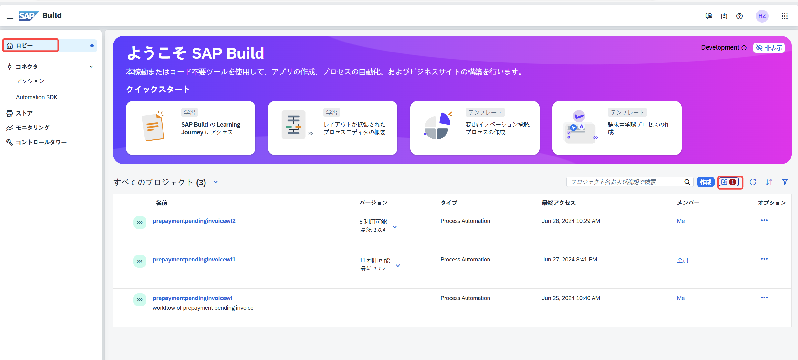
2. Release Project
    - 参考<https://help.sap.com/docs/build-process-automation/sap-build-process-automation/releasing-project>
    - Releaseの際、Destinationパラメータを選択する必要がある。上述のステップのSAP BPAのDestinationを選択する
3. Deploy Project
    - 参考<https://help.sap.com/docs/build-process-automation/sap-build-process-automation/deploy-project>
    - Deployの際、Destinationパラメータを選択する必要がある。上述のステップのSAP BPA中的Destinationを選択する

#### デプロイしたWorkflow Definitionを検査

1. Control Towerタブ -> Environment -> APIタブにナビゲートする
    - 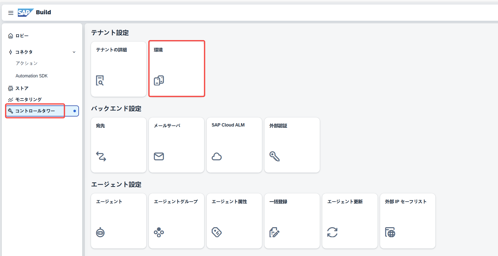
    - 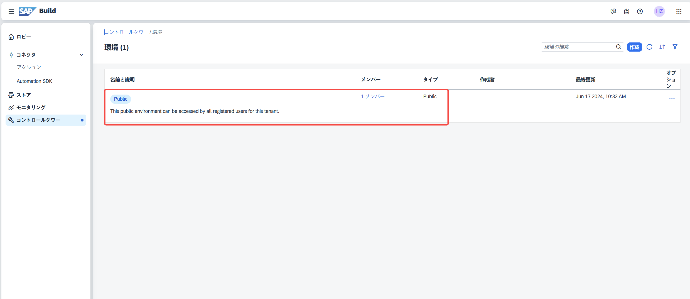
    - 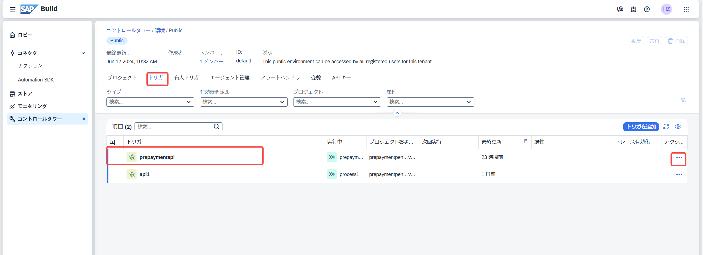
    - API Triggerのパラメータを検査する
    - 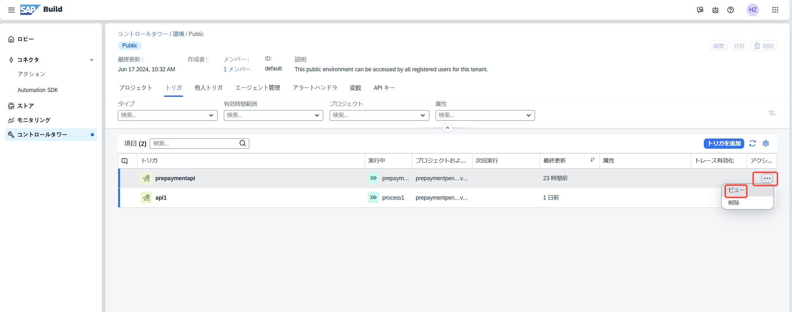
    - SAP BPA Workflow Definition IDを取得する
    - 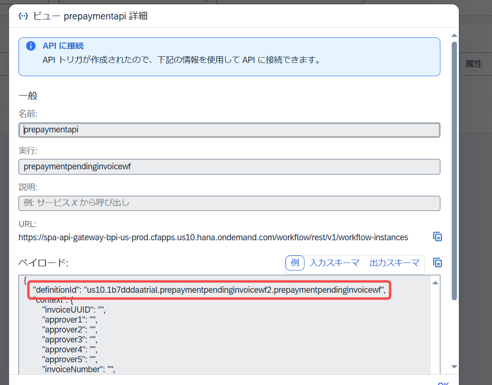

### SAP CAP Javaでトリガーしたワークフローのコードを修正する(Workflow definition IDを入れ替わる)

違う環境にデプロイしたため，Workflow definition IDの変化が発生する。`<region>.<subaccount>.<projectID>.<processID>`

1. `srv/src/main/java/customer/demo/PrePaymentServiceHandler.javaファイル`を探し、`sendToApprove`方法にナビゲートする。コード`payload.definitionId(XXX)`のパラメータを入れ替わる。

    ```bash
    payload.definitionId("us10.1b7dddaatrial.prepaymentpendinginvoicewf2.prepaymentpendinginvoicewf");
    ```

2. 上述のステップで取得した[SAP BPA Workflow Definition ID](#デプロイしたworkflow-definitionを検査)と入れ替わる
3. コンパイル+デプロイを再実施する、[前の設定](#sap-cap-プロジェクトデプロイ)を参照する

### SAP Build WorkZone 設定

参考：
    -<https://help.sap.com/docs/build-process-automation/sap-build-process-automation/configure-sap-build-work-zone-for-sap-build-process-automation>

### 使用

SAP Build WorkZoneで作成したサイトを通して入ってAppを使用する。
    - 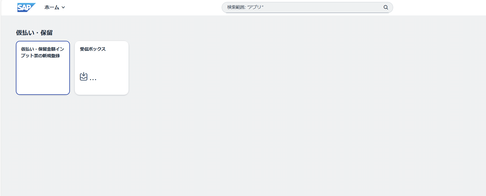
